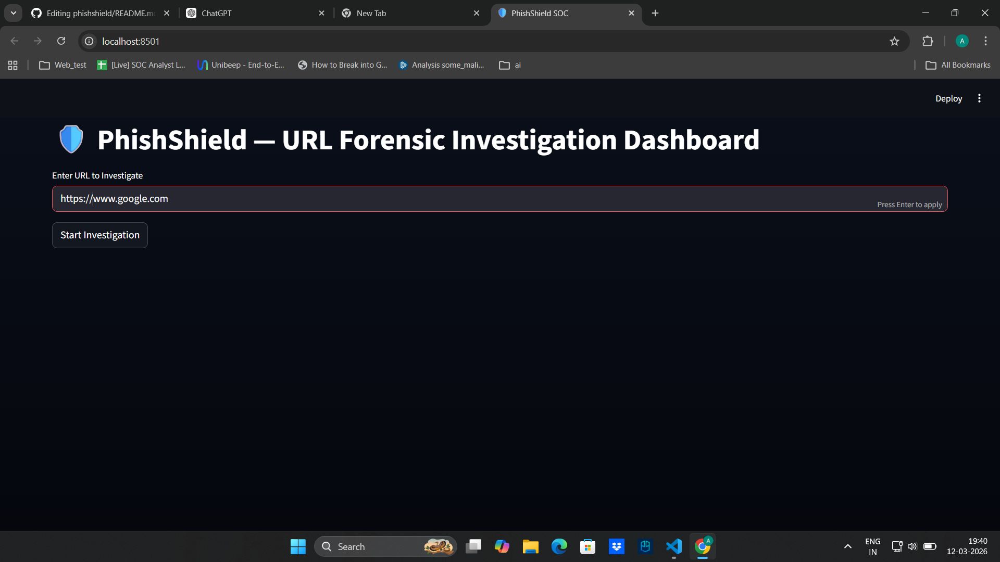

# 🛡️ PhishShield – URL Forensic Investigation Dashboard

PhishShield is a **SOC-style phishing investigation tool** that analyzes suspicious URLs using multiple security indicators and visual analytics.

The tool mimics workflows used by professional threat intelligence platforms and helps analysts quickly assess the risk of suspicious URLs.

---

## Features

* URL risk scoring engine
* Visual **risk gauge meter**
* **Redirect chain graph analysis**
* Domain intelligence (IP, ASN, geolocation)
* Suspicious keyword detection
* Entropy-based domain analysis
* Interactive SOC investigation dashboard

---

## Dashboard Preview


---

## Tech Stack

* Python
* Streamlit
* Plotly
* NetworkX
* DNS & WHOIS analysis

---

## Installation

Clone repository:

```
git clone https://github.com/arunchavan143/phishshield
cd phishshield
pip install -r requirements.txt
python app.py
```

Install dependencies:

```
pip install -r requirements.txt
```

Run application:

```
streamlit run app.py
```

Open browser:

```
http://localhost:8501
```

---

## Investigation Workflow

1. Enter suspicious URL
2. PhishShield extracts URL metadata
3. Calculates phishing risk score
4. Visualizes redirect infrastructure
5. Displays domain intelligence

---

## Example Detection

Example phishing-style URL:

```
paypal-secure-login-update-account.com
```

Indicators detected:

* Suspicious keywords
* High domain entropy
* Multiple redirects

---

## Future Improvements

* Website screenshot capture
* Passive DNS history
* Phishing form detection
* Threat intelligence integration

---

## License

MIT License
